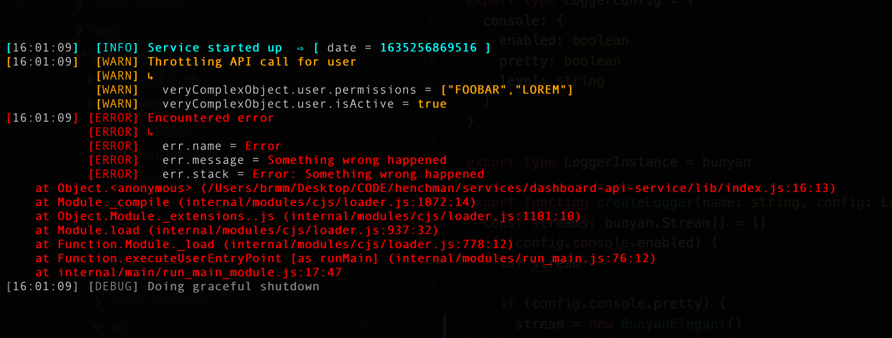

# Bunyan elegant

Opinionated elegant logs for bunyan.

## Example

```typescript
import BunyanElegant from '@marblecodes/bunyan-elegant'
import bunyan from 'bunyan'

const elegantStream = new BunyanElegant()
elegantStream.pipe(process.stdout)

const logger = bunyan.createLogger({
  name: 'application',
  stream: elegantStream,
  level: 'debug',
})

logger.info({ date: Date.now() }, 'Service started up')
logger.warn(
  { veryComplexObject: { user: { permissions: ['FOOBAR', 'LOREM'], isActive: true } } },
  'Throttling API call for user',
)

const err = new Error('Something wrong happened')
logger.error({ err }, 'Encountered error')

logger.debug('Doing graceful shutdown')
```



## Default configuration

```typescript
const config: BunyanElegantConfig = {
  timestampFormat: 'HH:mm:ss',
  colors: {
    trace: '#A9A9A9',
    debug: '#808080',
    info: '#00FFFF',
    warn: '#FFA500',
    error: '#FF0000',
    fatal: '#FF0000',
  },
}

const stream = new BunyanElegant(config)
```

## License

MIT
